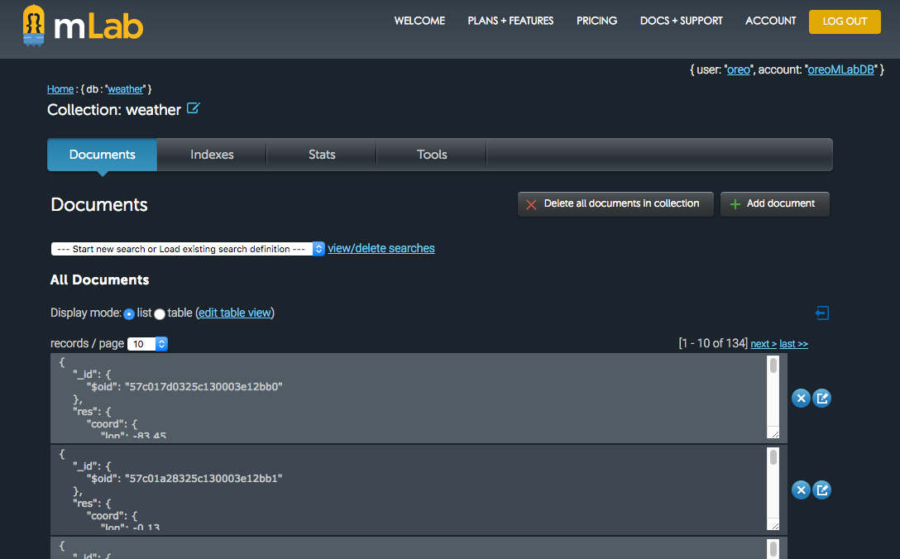

     ,-----.,--.                  ,--. ,---.   ,--.,------.  ,------.
    '  .--./|  | ,---. ,--.,--. ,-|  || o   \  |  ||  .-.  \ |  .---'
    |  |    |  || .-. ||  ||  |' .-. |`..'  |  |  ||  |  \  :|  `--, 
    '  '--'\|  |' '-' ''  ''  '\ `-' | .'  /   |  ||  '--'  /|  `---.
     `-----'`--' `---'  `----'  `---'  `--'    `--'`-------' `------'
    ----------------------------------------------------------------- 

this project is develop on the cloud9 .

and push to heroku , the example demo : https://orecenassignment3.herokuapp.com/

the demo can use the oreo@gmail.com ,password :oreo

this git is :https://github.com/OreoAfk/TestRepos.git

the project is save the data on mlab ,this is the mongodb 

